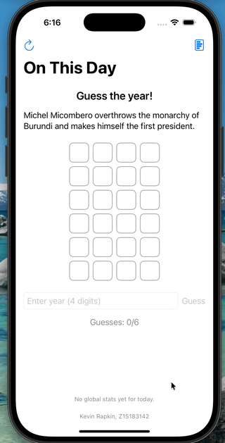
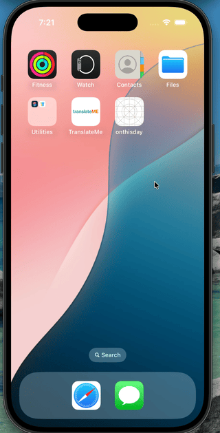

Submitted by: Kevin Rapkin ZNumber: Z15183142

Original App Design Project - README Template
===

# On This Day

## Table of Contents

1. [Overview](#Overview)
2. [Product Spec](#Product-Spec)
3. [Wireframes](#Wireframes)
4. [Demos](#Demos)
5. [Schema](#Schema)

## Overview

### Description

[Provide a brief description of your app, its purpose, and functionality.]

### App Evaluation

[Evaluation of your app across the following attributes]
- **Category:** [e.g., Social, Entertainment, Education]
- Game
- **Mobile:** [Is it a mobile application only?]
- Uses mobile touch screen functionality to be more accessible than typical website. Although it could also be recreated as a website with less functionality.
- **Story:**  [What story does your app tell?]
- The app combines a love for history, trivia, and a friendly competition of a guessing game. Users will be able to compete with their friends and learn about history and new trivia facts at the same time. People should love to use it.
- **Market:** [Target audience for the app]
- There are a lot of people who like trivia and also playing Worldle-like games. This targets that niche group who will be excited. 
- **Habit:** [Is it a daily use app or occasional use?]
- Yes, it allows for a daily play for people. But they can play repetively too. 
- **Scope:** [Is it a broad or narrow app in terms of features?]
- It's scope is possible to achieve satisfactorily before the end of the semester. But it is also scalable and more features could be added to make it even better if time allows.

## Product Spec

### 1. User Stories (Required and Optional)

**Required Must-have Stories**

* [X] User can log in/sign up for account
* [X] User can launch the app to the game screen that displays a historical blurb from an "on this day" API
* [X] Users are instructed to enter the year they believe this day in history happened
* [X] Users are given up to six chances to get the year right, with color-coded feedback based on their response to see how close they are
* [X] When the user gets the right answer, they are congratulated and offered to play again

**Optional Nice-to-have Stories**

* [X] User's scores are collected and stored in a database for that day so everyone can see how people are performing on average
* [X] Users can see their performance compared with global averages

### 2. Screen Archetypes

- [X] Launch Splash Screen
* Required User Feature: 
* [X] Have launch logo image and name and Z num
- [X] Login/Signup
* Required User Feature: 
* [X] Ability for user to login / signup for accounts
- [X] Game Screen
* Required User Feature: 
* [X] Shows historal blurb for the day and gives instructions
* [X] Has tile grid to show guesses
* [X] Has easy way to enter four digit year
* [X] Has color coded feedback for user guesses
* [X] Has option to view stats screen at any time
* [X] User can refresh to replay a different game any time
* [X] On game complete user can tap a button to copy a block of text that shows their performance in the game
- [X] Stats Screen
* Required User Feature: 
* [X] Shows global average statistics for game
* [X] Shows current user statistics for comparison
* [X] Statistics include things like win rate, guess number, etc.
- [X] Instructions Screen
* Required User Feature: 
* [X] Shows how to play

### 3. Navigation

**Tab Navigation** (Tab to Screen)

- [X] Game Screen
    - [X] Shows the game screen
- [X] Stats Screen
    - [X] Shows the stats screen
- [X] Instructions Screen
    - [X] Shows the Instructions screen

**Flow Navigation** (Screen to Screen)

- [X] Game Screen
  * leads to Stats Screen or Instructions
- [X] Stats Screen
  * leads back to Game Screen or Instructions
- [X] Instructions Screen
  * leads back to Game Screen or Stats

## Wireframes

[Add picture of your hand sketched wireframes in this section]

### [BONUS] Digital Wireframes & Mockups

## Demos

**Progress Demo 1**

**Progress Demo 2**

**Final Demo Video**

[Click here for YouTube Demonstration Video](https://youtu.be/AARlBFYwZcs)

## Schema 

### Models

[Event]
| Property | Type   | Description                                  |
|----------|--------|----------------------------------------------|
| id | String | unique id    |
| date | String | date of event     |
| year     | int   | numerical year
| desc     | String    | historical event description from API

[Game Result]
| Property | Type   | Description                                  |
|----------|--------|----------------------------------------------|
| id | String | unique id    |
| date | String | date of game    |
| correctyear     | int   | correct guess year
| guesses   | int   | number of guesses
| didWin | bool | whether user won 

### Networking

- [List of network requests by screen]
- External API: On This Day Events (Wikipedia-backed)
Base: https://byabbe.se/on-this-day/
- .GET https://byabbe.se/on-this-day/{month}/{day}/events.json

- Firebase Firestore: Global Stats
Collection: dailyStats
Document ID: YYYY-MM-DD (today’s date)
